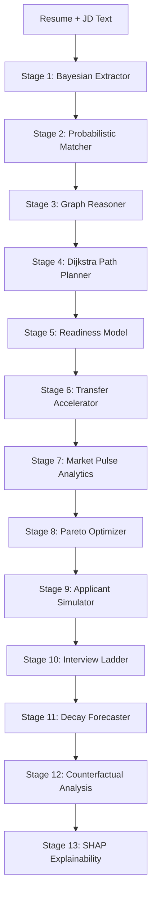
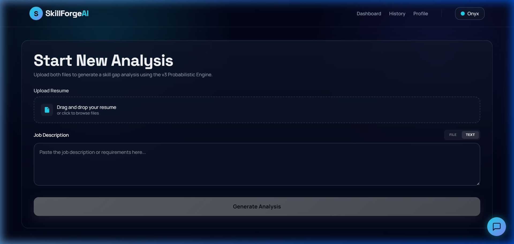
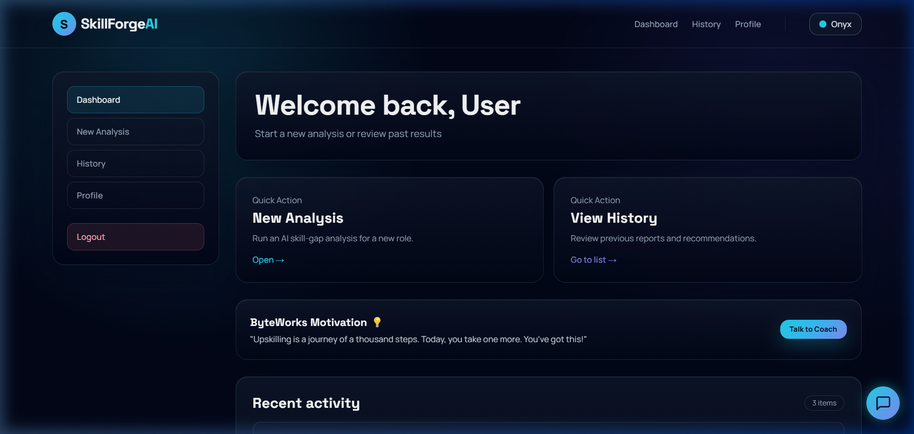
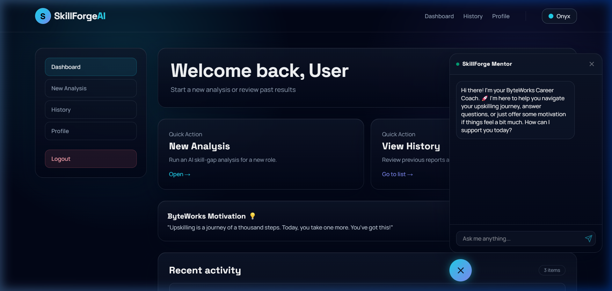
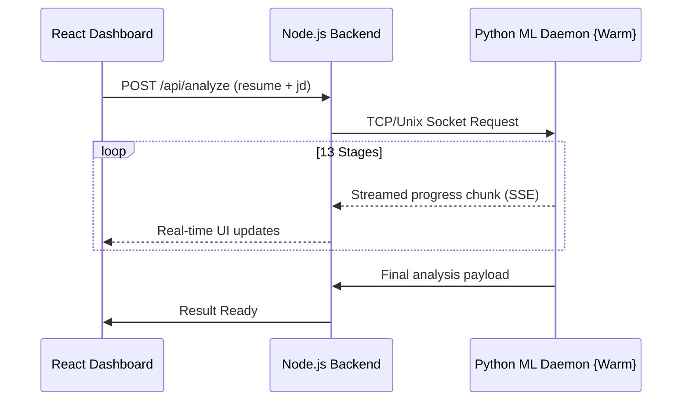

# SkillForge AI

[](https://github.com/arushihsura/SkillForge-AI)
[](https://github.com/arushihsura/SkillForge-AI)
[](https://opensource.org/licenses/MIT)

SkillForge AI is a **Role-Intelligence & Upskilling Engine** that replaces keyword-matching with deep Bayesian inference. Developed by **Team ByteWorks** for the IISc Hackathon, it maps your current skill possession to market requirements, identifies implicit gaps via graph reasoning, and optimizes your learning path through Pareto-frontier scheduling.

---

## 🚀 The v3.1 ML Engine: 13-Stage Inference Pipeline

Unlike traditional ATS systems, SkillForge treats resume text as **probabilistic evidence** for latent skill variables.



### 🧠 Key Innovations (v3.1)

| Stage | Innovation | Impact |
|:---:|:---|:---|
| **1** | **Bayesian Inference** | 300+ implication rules. Inferred "Attention Mechanisms" → P(Deep Learning)=0.95. |
| **6** | **Transfer Learning** | Recognizes core skill overlaps. Knowing PyTorch reduces JAX learning hours by 65%. |
| **8** | **Pareto Optimizer** | Generates 4 schedules (Sprint, Market-Optimal, Salary-Max, Balanced) based on goals. |
| **9** | **Cohort Simulator** | Monte Carlo simulation (N=2,000) comparing you against rival candidates. |
| **10** | **Interview Ladder** | Predicts pass probabilities for ATS, Phone Screen, Technical, and System Design. |
| **13** | **SHAP Explainability** | Quantifies the exact contribution of each skill to your readiness score. |
| **GenAI** | **Skill Gap Questioning** | Gemini-powered 15-question customized quiz to close your specific gaps. |
| **GenAI** | **YouSkill Career Coach** | Friendly NLP bot that handles roadmap prep and mental well-being. |
| **Match** | **JD Raw Input** | Toggle between file uploads and direct copy-pasting for job descriptions. |

---

## 📸 Visual Walkthrough

### Flexible Job Description Input
Toggle between file uploads and raw text for rapid iteration.



### YouSkill Motivation Hub
A friendly entry point for career coaching and well-being.



### YouSkill Career Coach
Empathetic, tone-aware mentorship.



### 🎥 Live Demo Showcase
Watch YouSkill in action (Animated Pipeline & Analysis):


*[Download High-Quality MP4 Version](./docs/images/demo.mp4)*

---

## 🏗 System Architecture

SkillForge uses a **Hybrid Warm-Process Architecture** to ensure zero-latency inference.



*The Python engine stays warm in memory, leveraging an **LRU-256 Cache** for instant repeat analysis.*

---

## 🛠 Tech Stack

- **Frontend:** React 18, Vite, Tailwind CSS (Glassmorphism design), Framer Motion
- **Backend:** Node.js (ESM), Express, MongoDB, Google Gemini API
- **ML Engine:** Python 3.10+, `shap`, `numpy`, `scikit-learn`
- **Transport:** Server-Sent Events (SSE) for real-time stage streaming

---

## 📦 Project Structure

```text
SkillForge-AI/
├── backend/            # Express.js API & MongoDB Integration
├── frontend/           # React Dashboard & Interactive Path UI
└── ml/
    ├── skill_gap_model.py # Core 13-stage inference engine
    └── daemon.py          # Persistent async daemon server
```

---

## 💻 Local Working Demo (Rapid Setup)

### 1) Prerequisites
- Node.js 18+
- Python 3.10+
- MongoDB Atlas or Local

### 2) Rapid Boot
```bash
# Clone the repository
git clone https://github.com/arushihsura/SkillForge-AI.git
cd SkillForge-AI

# Create .env from the provided template and add your GEMINI_API_KEY
# npm run install-all (Installs root, backend, and frontend)
npm run install-all

# Start concurrently
npm run dev
```

The app will be live at:
- **Frontend:** http://localhost:5173
- **Backend:** http://localhost:5000

---

## 👥 Meet Team ByteWorks
Developed for the **IISc Hackathon**, SkillForge AI aims to democratize career intelligence through empathetic AI.

**Team Members:**
- **[Arushi Tiwari](https://github.com/arushiihsura)**
- **[Aarya Patankar](https://github.com/rareya)**
- **[Hridaya Vashishtha](https://github.com/HridayaVashishtha)**
- **[Shivani Bhat](https://github.com/shivanibhat24)**

---
*Built with ❤️ by Team ByteWorks. SkillForge v3.1 is a hackathon-winning vision for the future of career growth.*
