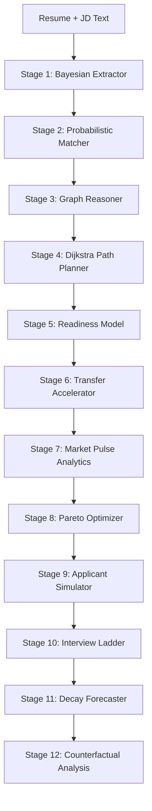

# SkillForge AI — Probabilistic Skill Intelligence (v3)

[](https://github.com/arushihsura/SkillForge-AI)
[](https://github.com/arushihsura/SkillForge-AI)
[](https://opensource.org/licenses/MIT)

SkillForge AI is a **Role-Intelligence & Upskilling Engine** that replaces keyword-matching with deep Bayesian inference. It maps your current skill possession to market requirements, identifies implicit gaps via graph reasoning, and optimizes your learning path through Pareto-frontier scheduling.

---

## 🚀 The v3 ML Engine: 12-Stage Inference Pipeline

Unlike traditional ATS systems, SkillForge treats resume text as **probabilistic evidence** for latent skill variables.



### 🧠 Key Innovations

| Stage | Innovation | Impact |
|:---:|:---|:---|
| **1** | **Bayesian Inference** | 300+ implication rules. Inferred "Attention Mechanisms" → P(Deep Learning)=0.95. |
| **6** | **Transfer Learning** | Recognizes core skill overlaps. Knowing PyTorch reduces JAX learning hours by 65%. |
| **8** | **Pareto Optimizer** | Generates 4 schedules (Sprint, Market-Optimal, Salary-Max, Balanced) based on goals. |
| **9** | **Cohort Simulator** | Monte Carlo simulation (N=2,000) comparing you against rival candidates. |
| **10** | **Interview Ladder** | Predicts pass probabilities for ATS, Phone Screen, Technical, and System Design. |
| **12** | **Keystone Analysis** | Identifies the *single* most impactful skill to learn next for maximum ROI. |

---

## 🏗 System Architecture

SkillForge uses a **Hybrid Warm-Process Architecture** to ensure zero-latency inference.


*The Python engine stays warm in memory, leveraging an **LRU-256 Cache** for instant repeat analysis.*

---

## 🛠 Tech Stack

- **Frontend:** React 18, Vite, Tailwind CSS (Glassmorphism design)
- **Backend:** Node.js, Express, MongoDB, SSE (Server-Sent Events)
- **ML Engine:** Python 3.10+, `asyncio`, `math`, `heapq` (Minimalist & High-performance)
- **Transport:** Unix domain sockets (Linux/Mac) or TCP (Windows)

---

## 📦 Project Structure

```text
SkillForge-AI/
├── backend/            # Express.js API & MongoDB Integration
├── frontend/           # React Dashboard & Interactive Path UI
└── ml/
    ├── skill_gap_model.py # Core 12-stage inference engine
    └── daemon.py          # Persistent async daemon server
```

---

## ⚡ Setup & Installation

### 1) Prerequisites
- Node.js 18+
- Python 3.10+
- MongoDB (Atlas or Local)

### 2) Installation
```bash
# Clone the repository
git clone https://github.com/arushihsura/SkillForge-AI

# Install Node dependencies
cd SkillForge-AI/backend && npm install
cd ../frontend && npm install

# Install optional Python helpers
pip install flask flask-cors
```

### 3) Configuration (`backend/.env`)
```env
MONGO_URI=your_mongodb_uri
JWT_SECRET=your_jwt_secret
SF_MODE=tcp   # WINDOWS: tcp, LINUX/MAC: unix
```

### 4) Running the App
For the best experience, run in separate terminals:
- **Backend:** `cd backend && npm run dev`
- **Frontend:** `cd frontend && npm run dev`
- **ML Engine:** `python ml/daemon.py --tcp 8001` (Windows)

---

## 👥 Meet the Team & IISc Hack
Developed for the **IISc Hackathon**, SkillForge AI aims to democratize career intelligence.

> [!TIP]
> **Pro Tip:** Use the "Pareto Balanced" schedule if you're looking for the best mix of salary growth and learning efficiency.

---
*Built with ❤️ at IISc. SkillForge AI is an open-source project.*
